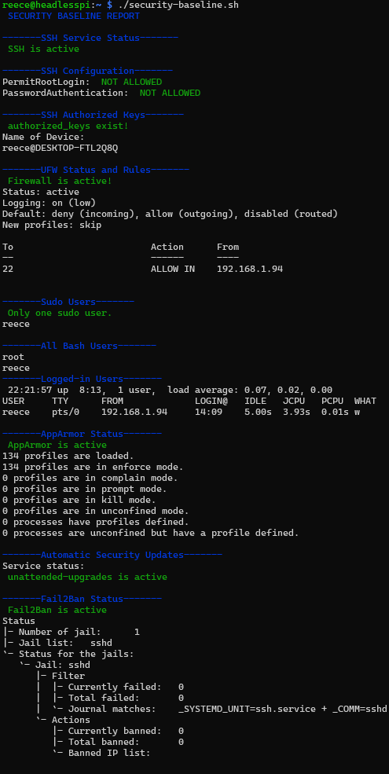

# Week 5 - Advanced Security and Monitoring Infrastructure 

### Implement Access Control using SELinux or AppArmor, with documentation showing how to track and report on access control settings.

AppArmor 
https://gitlab.com/apparmor/apparmor/-/wikis/Documentation
https://wiki.debian.org/AppArmor/HowToUse


As the distro im using (Debian 13) comes with AppArmor, I will check to see the status using:

```bash
 apparmor_status
```

This comes back with a message stating that the apparmor module is loaded, but the filesystem is not mounted.


 According to the AppArmor documentation, Debian systems require these two kernel parameters to enable full AppArmor support: 

```bash
apparmor=1 security=apparmor
```


However, Raspberry Pi devices store their boot configuration differently from standard Debian installations. The usual location (/etc/default/grub) does not exist on ARM systems. After checking the Raspberry Pi documentation, I found that kernel parameters must be added to /boot/firmware/cmdline.txt

I opened the file using:
```bash
sudo nano /boot/firmware/cmdline.txt
```


and made the nessesary changes, ensuring that the changes i make are on the same line as the rest of the text otherwise this will break the file.


then rebooted the system using 

```bash
sudo reboot 
```

so the changes could take effect.

I then verified that AppArmor was active by running:

```bash
sudo apparmor_status
```


This showed that AppAmor was running correctly, and the filesystem was mounted. 


By default, AppArmor only includes a minimal set of profiles. To expand coverage to more common applications, I installed the recommended profiles using:

```bash
sudo apt install apparmor-profiles apparmor-profiles-extra
```


and then enabled them using:

```bash
sudo aa-enable etc/apparmor.d/*
```

which selects all files inside apparmor.d and puts them into enforce mode.

I verified the status again and saw that the profiles had been enabled and access control restrictions were applied to all programs with profiles.


### Configure automatic security updates with evidence of implementation

On Debian 13, the recommended tool for automatic security updates is unattended-upgrades. This service automatically checks for security patches and installs them without user intervention, we can install it using: 

```bash
sudo apt install unattended-upgrades
```


Once installed, I enabled automatic security updates using the Debian configuration helper:

```bash
sudo dpkg-reconfigure unattended-upgrades
```

I then checked that the unattended-upgrades services and timers were active by running:

```bash
systemctl status unattended-upgrades
systemctl status apt-daily.timer
systemctl status apt-daily-upgrade.timer
```


To test that the service was working correctly, I performed a simulated upgrade using:
```bash
sudo unattended-upgrade --dry-run --debug
```


This command outputs detailed debug information showing which packages would be upgraded if updates were available.

Finally, I checked the unattended-upgrades log file to confirm the service had already performed routine update checks:

```bash
cat /var/log/unattended-upgrades/unattended-upgrades.log
```


### Configure fail2ban for enhanced intrusion detection

Fail2Ban is a log-monitoring intrusion prevention tool. It watches system logs for repeated authentication failures and automatically blocks suspicious IP addresses using firewall rules.

To begin, I installed Fail2Ban using:

```bash
sudo apt install fail2ban
```

After installation, I checked the service status to ensure it was running:

```bash
sudo systemctl status fail2ban
```


Fail2Ban ships with a default configuration file located at:

```bash
/etc/fail2ban/jail.conf
```


However, modifying this file directly is not recommended as stated in the top of the jail.conf file. Instead, Fail2Ban encourages the use of override files such as:

```bash
/etc/fail2ban/jail.d/
```

I created my own configuration file to enable protection for SSH:

```bash
sudo nano /etc/fail2ban/jail.d/ssh.local
```

Inside this file, I added the following configuration:
```bash
[sshd]
enabled = true
port = ssh
filter = sshd
logpath = /var/log/auth.log
maxretry = 3
bantime = 60m
findtime = 60m
```


This enables the SSH jail, sets the maximum allowed failed login attempts to 5, and bans offending IPs for 10 minutes.

I then restarted the service to apply the changes:

```bash
sudo systemctl restart fail2ban
```

To verify that the SSH jail was enabled, I ran:

```bash
sudo fail2ban-client status
```


And to get detailed information about the SSH jail specifically:

```bash
sudo fail2ban-client status sshd
```


This confirmed that the jail was active and watching the correct log file.

Because my firewall currently whitelists only a single trusted IP, external devices cannot reach SSH at all. This means Fail2Ban cannot observe login attempts from the rest of the network. However, Fail2Ban still runs correctly in the background and monitors the logs.


### Create a security baseline verification script (`security-baseline.sh`) that runs on the server (executed via SSH) and verifies all security configurations from Phases 4 and 5

The script that i've made checks SSH, UFW, users, AppArmor, Fail2Ban, and automatic security updates, highlighting issues in red and healthy configurations in green.

Every line of code has been commented for clarity.

You can view the security baseline verification script here: [os-journal/scripts/security-baseline.sh](scripts/security-baseline.sh)

I transfered the script to the server using:
```powershell
scp -s "path\to\script" user@ipaddr:/path/to/destination
```

then made it executable using:
```bash
chmod +x security-baseline.sh
```

Here is the expected output:




### Create a remote monitoring script (`monitor-server.sh`) that runs on your workstation, connects via SSH, and collects performance metrics from the server.

The monitor-server.ps1 script is a powershell script that connects to the server via SSH and collects performance metrics such as CPU usage, memory usage, disk space, running processes, and network statistics. It lets me quickly check the health of the server from my client pc.

Every line of code has been commented for clarity.

You can view the remote monitoring script here: [os-journal/scripts/security-baseline.ps1] (/scripts/monitor-server.ps1)

The script is ran like so:

```powershell
./monitor-server.ps1
```


