# Week 6 - Performance Evaluation and Analysis

## Phase 6 Overview

Week 6 focuses on evaluating the performance of the Raspberry Pi OS 
Lite server under different workloads. The aim is to understand system 
behaviour by monitoring CPU, memory, disk I/O, network, and thermal 
characteristics, and to identify potential bottlenecks or optimisation 
opportunities. All administration and testing were performed remotely 
from the Windows 11 workstation via SSH.

## Testing Methodology

### 1. Baseline System Performance

Before introducing any workload, I recorded idle system metrics using 
a simple script that logs usage over 5 minutes then uses grep to get
data out of log files, which is then written to a summary log file.

This ensures that later measurements reflect the impact of workloads 
rather than background processes.

Here is the script used to measure and filter data: 
[run_tests_5min.sh](scripts/run_tests_5min.sh)

And here is the log file output for the baseline (no unnessesary 
processes running): 
[Summary.log](scripts/5minTest-Summary.log)

#### Baseline Performance Results and Analysis

The baseline measurements represent the system in an idle state, with 
no user applications running other than essential background services
and the monitoring script itself. The results provide a reference 
point against which later workload tests can be compared.

### CPU and Load Analysis

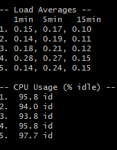

During the baseline test, the 1 minute load average sat in the range 
of 0.14 - 0.28 this is fine as the Raspberry Pi has 4 cores which 
indicates that the system was not under stress during the test. 

Cpu utilisation was measured using idle time, with the lowest idle 
percentage being 93.8%, with an average percentage of 95.42%. This 
confirms that the Raspberry Pi was largely inactive during baseline
measurement and that no background processes were consuming 
significant CPU time.

###  Memory Analysis

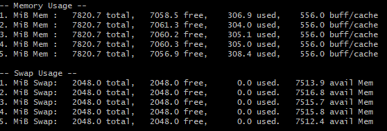

Baseline memory usage remained stable across all five measurement 
intervals. Active system memory usage ranged between approximately 304
MiB and 308 MiB. This represents less than 5% of total available RAM,
indicating that the system was largely idle and under no pressure.

Free memory remained high throughout the test, averaging around 7.05
GiB, while buffer and cache usage remained constant at approximately
556 MiB. This behaviour is expected on Linux systems, where unused
memory is opportunistically used for filesystem caching to improve performance without impacting application availability.

Swap usage remained at 0 MiB for all five iterations, with the full 
2048 MiB of swap space available at all times. This confirms that the 
system did not require paging to disk and that physical memory was 
more than sufficient during baseline operation.

### Disk and I/O Performance

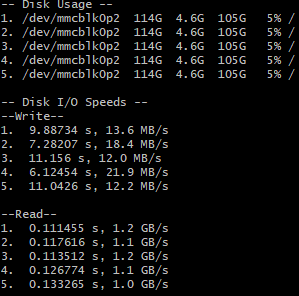

Disk usage remained constant throughout the baseline test, with 
approximately 5% of the root filesystem utilised. Disk I/O activity 
was minimal outside of the synthetic read/write tests, indicating no 
background disk-intensive processes.

Measured write speeds ranged between 12.0 and 21.9 MB/s, while read 
speeds were significantly higher, reaching 1.2 GB/s. This behaviour is 
consistent with SD card performance characteristics and Linux 
filesystem caching.

### Network Analysis

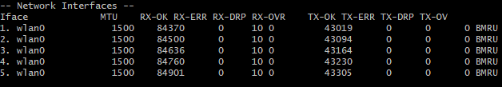

Network activity was monitored on the wlan0 interface during the 
5-minute baseline test. Across five iterations, both received (RX) and 
transmitted (TX) packet counts increased steadily, reflecting normal 
background traffic generated by SSH connectivity and system services.

No receive or transmit errors were observed, and packet drops remained 
constant at a low level (RX-DRP = 10), indicating stable wireless 
performance with no signs of congestion or retransmission issues. 
Overall, network behaviour remained consistent and reliable under idle 
conditions, providing a stable baseline for comparison against 
network-intensive workloads in later tests.

### Thermal Behaviour Analysis

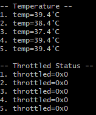

During the 5-minute baseline test, CPU temperature remained stable, 
ranging between 37.4 °C and 39.4 °C across all five iterations. These 
values are well within safe operating limits for the Raspberry Pi 4 
and indicate effective passive cooling under idle conditions.

The throttling status remained 0x0 throughout the test, confirming 
that no thermal or voltage throttling occurred. This shows that the 
system had sufficient thermal headroom during baseline operation and 
provides confidence that any performance changes observed in later 
workload tests can be attributed to application load rather than 
thermal constraints.

### Baseline Performance Summary

Overall, the baseline results show that the Raspberry Pi OS Lite 
server operates efficiently under idle conditions. CPU utilisation 
remained low, memory usage was stable with no swap activity, disk 
usage showed no unexpected I/O, network activity was minimal and 
error-free, and system temperatures remained well below throttling 
thresholds.

These results confirm that the system is in a healthy and stable state 
and provide a reliable reference point for evaluating the impact of 
application workloads in subsequent performance tests.


## 2. Testing applications

This phase evaluates system behaviour under representative application 
workloads. For each test, the application and monitoring script were 
started simultaneously using a single shell command:

Each workload was then exercised for approximately five minutes to 
simulate typical usage patterns relevant to a headless Raspberry Pi 
server. System metrics were collected at one-minute intervals using 
the same monitoring methodology as the baseline test, ensuring results 
are directly comparable.

### FFmpeg 

Command used: 
```bash
ffmpeg -f lavfi -i testsrc=size=1280x720 -t 300 -pix_fmt yuv420p testsrc.mp4
```
Results


Graphs

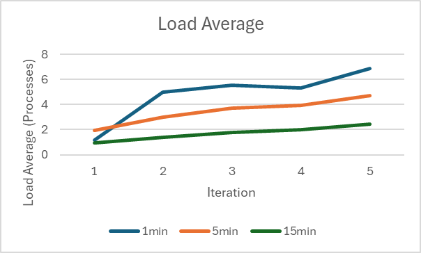 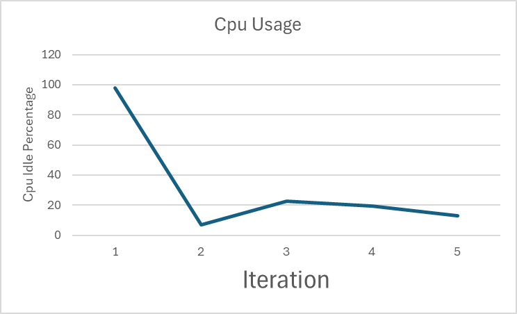 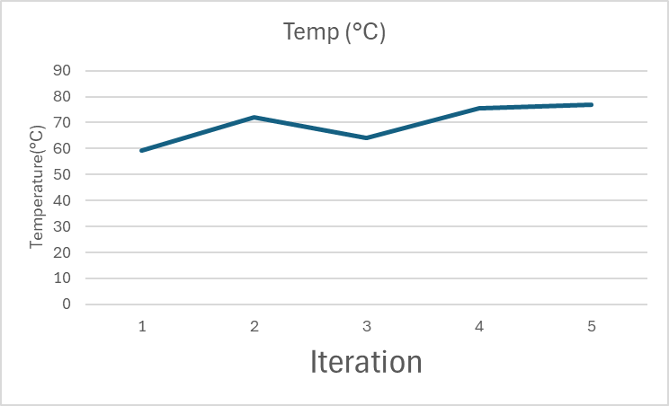
 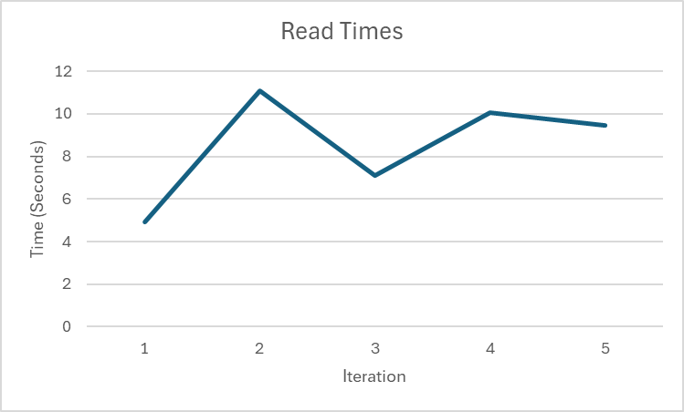 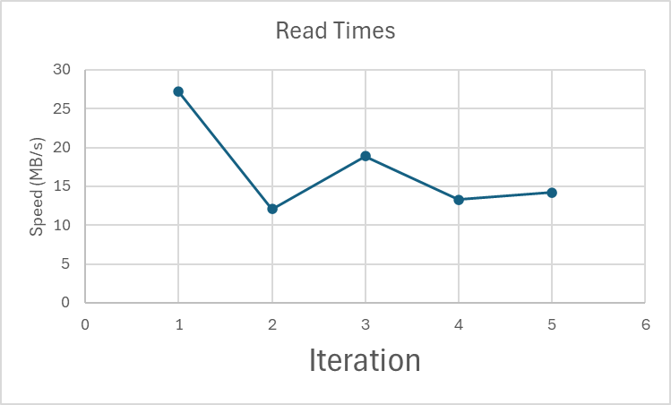
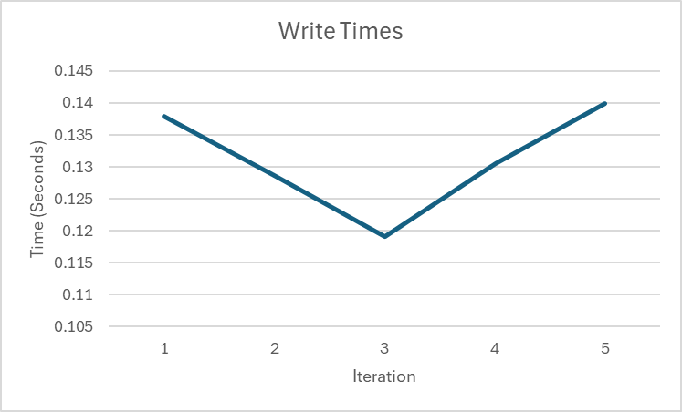 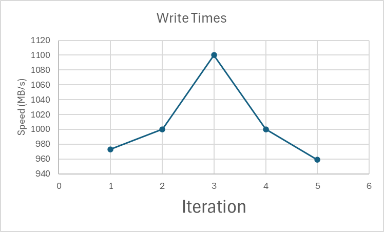

Analysis

FFmpeg encoding heavily loaded the CPU, with the 1-minute load average rising from ~0.2 at baseline to 6.87 which means the CPU is overloaded. CPU idle dropped from ~95% to as low as 6.8%, confirming a CPU-bound workload.

Memory usage increased modestly (~305 MiB → ~600 MiB) with no swap usage. Disk write speeds varied between 12–27 MB/s, while read speeds remained high due to caching.

CPU temperature peaked at 76.9 °C, but no throttling occurred, showing the Pi handled the workload stably.

In summary, FFmpeg stresses CPU and thermal limits, while memory, disk, and network remain largely unaffected.

### Memcached 
Results

Graphs

Analysis
### SQlite 
Results

Graphs

Analysis
### iperf3 
Results

Graphs

Analysis
### Luanti Server
Results

Graphs

Analysis