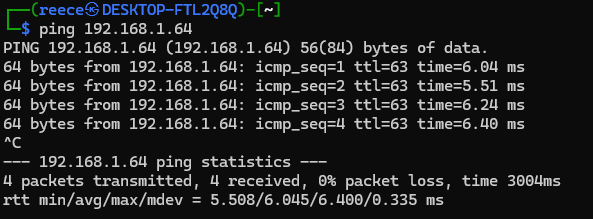

## Phase 7 - Security Audit Report

This week focused on conducting a comprehensive security audit of the Raspberry Pi server and evaluating the overall system configuration. The goal was to identify any remaining security risks, verify that all security measures from previous phases are effective and justify the current system configuration.

The audit combined automated security scanning with lynis, network assessment via nmap, access control verification with AppArmor, service review using systemctl and configuration evaluation to produce a detailed security baseline and risk assessment.

### Security Scanning with Lynis

Lynis is a widely-used auditing tool for Unix-based systems. It scans for configuration issues, security risks and compliance gaps.

#### Installation and Initial Scan
```bash
sudo apt install lynis
sudo lynis audit system
```

The initial scan produced a security report highlighting warnings and suggestions across authentication, user accounts, system software, network configuration and logging:

| Area | Finding | Risk |
|------|--------|--------|
| Firewall | Disabled at audit start | Unrestricted inbound access if services exposed |
| Auditing | auditd not enabled	| No audit trail of system activity |
| Process Accounting | Not enabled | No visibility of executed commands |
| Performance Monitoring | sysstat not installed | No historical resource usage data |
| IDS / IPS | None present | No intrusion detection capability |
| Malware Detection | Not installed | Potential persistence of malicious files |
| File Integrity Monitoring | Not configured | Unauthorized file changes undetectable |
| Password Policy |	No aging or complexity rules | Weak credentials possible |
| Automatic Updates | Disabled | Security patches not applied automatically |
| Logging |	Basic logging only | Limited forensic capability |
| Mandatory Access Control | Inactive |	No application-level confinement |
| SSH Hardening | Permissive defaults | Increased attack surface |
| Monitoring | No active alerting | Attacks could go unnoticed |
| Package Integrity | Not enabled | Tampered packages undetectable |

Lynis score before: 64

[lynis-before.dat](logs/lynis-before.dat)

Observation: The initial hardening index indicated areas for improvement, including SSH configuration, firewall rules and unused services.

#### Remediation and Rescan

Following the initial Lynis audit, targeted remediation steps were applied to address the most significant security findings. The focus was on strengthening access control, reducing the attack surface, and enforcing layered defensive controls, rather than attempting to enable every optional or enterprise-grade feature.

The following actions were implemented:

SSH access was hardened by enforcing key-based authentication and disabling direct root login via /etc/ssh/sshd_config configuration. This ensures that only authorised users in possession of valid private keys can access the system and eliminates password-based brute-force attacks against privileged accounts.

The UFW firewall was re-enabled and configured with a ip whitelist with a port specified, restricting inbound SSH connections to the trusted client workstation IP only. The firewall now enforces a default-deny ruleset, significantly reducing network exposure.

Mandatory Access Control was activated by enabling AppArmor at boot and setting all available and relevant profiles to enforce mode. Additional AppArmor profiles were installed to extend coverage to common system services, limiting the potential impact of service compromise.

Host-based intrusion prevention was introduced by installing and configuring Fail2Ban. The SSH jail was enabled and tuned to automatically block repeated authentication failures, providing active protection against brute-force attempts on the SSH service.

System accountability and monitoring were improved by enabling audit logging and process accounting. The auditd service was installed and activated to provide an audit trail of system events, while acct and sysstat were enabled to record process execution history and system activity metrics for later analysis.

Malware detection capabilities were added by installing ClamAV, with virus definition databases present and scheduled scans configured. This introduces an additional defensive layer to detect potentially malicious files on the system.

File integrity monitoring was implemented using Tripwire, allowing detection of unauthorised changes to critical system files and configurations through scheduled integrity checks.

Authentication policies were strengthened by enforcing password aging, complexity, and reuse restrictions via PAM configuration. These changes mitigate the risk of weak or reused credentials and improve overall account security.

Automated security patching was enabled using unattended-upgrades, ensuring that security updates are applied automatically without requiring manual intervention, reducing exposure to known vulnerabilities.

Package integrity verification tools were installed, including debsums and apt-show-versions, to detect modified packages and assist with version tracking and update validation.

Finally, unused packages were removed and unnecessary services were disabled to further reduce the system’s attack surface and minimise potential vectors for exploitation.

After applying these changes, the system was rescanned using Lynis:

Lynis score after: 81

[lynis-after.dat](logs/lynis-after.dat)


The rescan confirmed a clear improvement in the system’s security posture, reflected by an increased hardening index and a reduction in high-priority warnings. Remaining findings were primarily related to advanced kernel hardening, extended audit rule definitions and enterprise monitoring features.

These results demonstrate that targeted remediation based on audit feedback can measurably improve system security while maintaining system stability, usability, and performance.

### Network Security Assessment with nmap

nmap was used to assess network exposure and detect open ports:

```bash
nmap -sV -v -Pn 192.168.1.64
```

#### Findings:


All scanned TCP ports are filtered, meaning the firewall is actively dropping unsolicited packets.

No services are exposed to unauthorized hosts.

-Pn ensures that the host is treated as online, confirming that the lack of responses is due to filtering, not host unavailability.

We also test that the host is not down by pinging it afterwards



### SSH security verification


### Access Control Verification

User and sudo privileges were verified:
```bash
getent passwd
getent group sudo
```

Only trusted accounts have sudo rights.

AppArmor enforcement confirmed:

```bash
sudo apparmor_status
```

All profiles are in enforce mode, and no violations were reported.

Access control is correctly implemented, with separation of privileges and process confinement in place.

### Service Audit and Justification

Active services were reviewed using:
systemctl list-units --type=service --state=running

Service Inventory with Justifications:
TODOTODOTODOTODOTODOTODOTODOTODOTODOTODOTODOTODOTODOTODO

### System Configuration Review
Key configuration checks:

### Remaining Risk Assessment
Risk	Likelihood	Impact	Mitigation

## Summary
